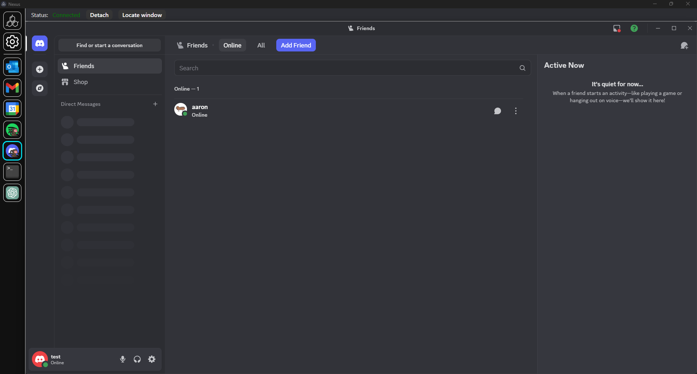

# [Nexus](https://github.com/aarontburn/nexus-core): Discord Monkey

  

A module for [Nexus](https://github.com/aarontburn/nexus-core) to "embed" Discord as a Nexus module...

And by "embed", this just takes your Discord window and monkeys it around.

  

## Required Dependencies
### Module Dependencies
You will need the following modules installed into Nexus.
- [**Monkey Core**](https://github.com/aarontburn/nexus-monkey-core)

### Application Dependencies
The following applications need to be installed to your computer.
- [**Discord**](https://discord.com/)

## Installation
1. Download and install all dependencies.
2. Download the latest release `.zip`. 
3. In Nexus, navigate to **Settings** > **Import Module**
4. Select the downloaded `.zip` file to install.

## Usage
- On startup (or when the `Locate window` button is pressed), Discord Monkey will look for your open Discord window, and, if found within 10 seconds, will start monkeying the window into Nexus.
- By providing a path to your Discord executable in the Settings, you unlock the following features:
  -  Opening the Discord app while it's already embedded into Nexus will swap to the Discord Monkey module.
  -  The `Locate window` button will start a new instance of Discord if one isn't found.

## Limitations:
- Discord notifications will appear, but this will hide the red bubble.
